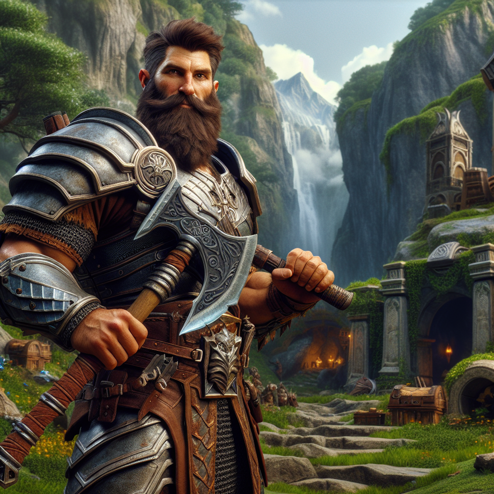

# Make an epic character

## System prompt

## User prompt

Scene: our hero (description and picture provided) is atop of a mountain fighting a dragon. The dragon is twice as tall as the hero and about to breathe fire in the general direction of the hero

Hardwon Surefoot is a human fighter raised by dwarves, earning him the nickname “The Bastard of the Mountain.” Towering at 6'6", he is a mountain of muscle with a thick beard and an equally thick personality, wielding the mighty great axe of Iron Deep. Having delved deeper into the dwarven mines than anyone before, Hardwon now seeks to prove himself in the wider world, leaving behind the underground to pursue his next great adventure above ground.  

## Result

[Video](./20250915-142417-sora.mp4)